# 🖼️ Classificação de Estilos Artísticos em Pinturas Reais com Pipeline Clássico de PDI

<p align="center">
  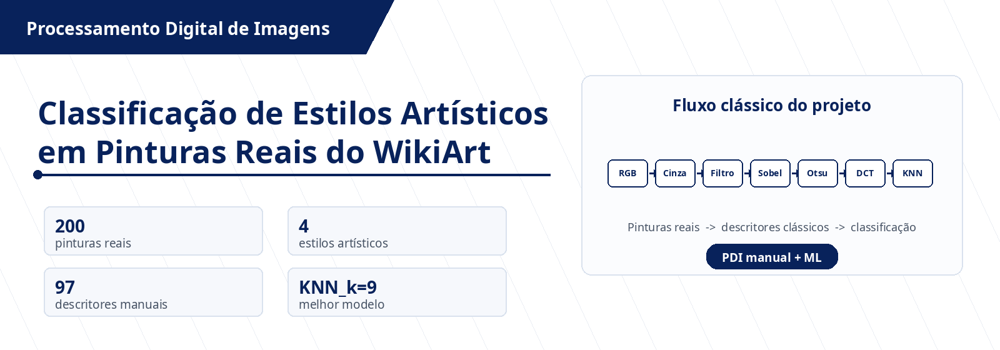
</p>

<p align="center">
  
  
  
  
</p>

> Projeto aplicado de **Processamento Digital de Imagens** voltado à análise e classificação de **estilos artísticos em pinturas reais**, usando descritores clássicos implementados manualmente e modelos simples de aprendizado de máquina.

---

## 📌 Descrição do projeto

Este repositório apresenta um pipeline clássico de **Processamento Digital de Imagens (PDI)** aplicado à classificação de pinturas reais do **WikiArt** em quatro estilos artísticos: **Baroque**, **Cubism**, **Impressionism** e **Realism**.

A proposta prioriza o entendimento dos algoritmos clássicos: as principais etapas foram implementadas manualmente, sem uso de funções prontas para convolução, Sobel, Otsu, morfologia, DCT, quantização, entropia e extração de características.

O classificador recebe um vetor com **97 descritores numéricos** extraídos de cada imagem e realiza a predição do estilo artístico com modelos como **KNN** e **Regressão Logística**.

---

## 🎯 Objetivo

Desenvolver e avaliar um sistema capaz de **extrair características visuais clássicas de pinturas reais** e utilizá-las em modelos simples de aprendizado de máquina para classificar estilos artísticos.

<table width="100%">
  <tr>
    <th width="20%" align="center">Aspecto analisado</th>
    <th width="80%" align="center">Relevância no projeto</th>
  </tr>
  <tr>
    <td><strong>Cor</strong></td>
    <td>Representa padrões cromáticos presentes nos diferentes estilos artísticos e ajuda a distinguir tendências visuais entre pinturas mais escuras, claras ou saturadas.</td>
  </tr>
  <tr>
    <td><strong>Bordas</strong></td>
    <td>Captura contornos, fragmentações e estruturas visuais por meio do operador de Sobel, contribuindo para diferenciar composições mais suaves de composições mais geométricas.</td>
  </tr>
  <tr>
    <td><strong>Regiões segmentadas</strong></td>
    <td>Permite descrever áreas claras, escuras e componentes conectados após Otsu e morfologia, fornecendo informações sobre organização espacial da imagem.</td>
  </tr>
  <tr>
    <td><strong>Frequência</strong></td>
    <td>Analisa energia em baixa, média e alta frequência com DCT em blocos 8x8, permitindo observar textura, compressibilidade e variação estrutural.</td>
  </tr>
</table>

---

## ✅ Requisitos do projeto atendidos

<table width="100%">
  <tr>
    <th width="32%" align="center">Requisito solicitado</th>
    <th width="68%" align="center">Como foi atendido</th>
  </tr>
  <tr>
    <td><strong>Dataset relacionado ao tema</strong></td>
    <td>Foi utilizado um recorte real do WikiArt com 200 pinturas, distribuídas de forma balanceada entre Baroque, Cubism, Impressionism e Realism.</td>
  </tr>
  <tr>
    <td><strong>Transformação de imagem</strong></td>
    <td>Foram aplicadas conversão RGB → cinza, filtragem espacial e detecção de bordas por Sobel, com implementação manual das etapas centrais.</td>
  </tr>
  <tr>
    <td><strong>Compressão / informação</strong></td>
    <td>Foram implementadas DCT em blocos 8x8, quantização, entropia, MSE, PSNR e percentual de coeficientes zerados para análise da informação visual.</td>
  </tr>
  <tr>
    <td><strong>Segmentação</strong></td>
    <td>A limiarização automática de Otsu foi implementada manualmente para gerar máscaras binárias a partir das imagens em escala de cinza.</td>
  </tr>
  <tr>
    <td><strong>Morfologia</strong></td>
    <td>Foram implementadas dilatação, erosão, abertura e fechamento usando elemento estruturante 3x3, aplicados sobre as máscaras segmentadas.</td>
  </tr>
  <tr>
    <td><strong>Aprendizado de máquina</strong></td>
    <td>Os descritores extraídos foram usados em modelos de classificação, principalmente KNN e Regressão Logística, para prever o estilo artístico.</td>
  </tr>
</table>

---

## 🧰 Recursos técnicos utilizados

A tabela abaixo resume os principais recursos técnicos do projeto. As bibliotecas de imagem foram usadas de forma restrita, preservando a implementação manual das etapas centrais de PDI.

---

<table width="100%">
  <tr>
    <th width="8%" align="center">Ícone</th>
    <th width="12%" align="center">Recurso</th>
    <th width="27%" align="center">Uso no projeto</th>
    <th width="53%" align="center">Observação técnica</th>
  </tr>
  <tr>
    <td align="center"></td>
    <td><strong>Python</strong></td>
    <td>Linguagem principal do projeto.</td>
    <td>Usada para implementar o pipeline, extrair características e treinar modelos.</td>
  </tr>
  <tr>
    <td align="center"></td>
    <td><strong>OpenCV</strong></td>
    <td>Leitura e escrita de imagens.</td>
    <td>Não foi usado para resolver as etapas principais, como Sobel, Otsu, morfologia ou DCT.</td>
  </tr>
  <tr>
    <td align="center"></td>
    <td><strong>NumPy</strong></td>
    <td>Manipulação matricial.</td>
    <td>Base para cálculos numéricos, percursos em matriz e vetores de características.</td>
  </tr>
  <tr>
    <td align="center"></td>
    <td><strong>Pandas</strong></td>
    <td>Organização de resultados.</td>
    <td>Usado para salvar e ler tabelas de características, métricas e comparação de modelos.</td>
  </tr>
  <tr>
    <td align="center"></td>
    <td><strong>scikit-learn</strong></td>
    <td>Aprendizado de máquina.</td>
    <td>Usado apenas na etapa permitida de treino e avaliação dos modelos.</td>
  </tr>
  <tr>
    <td align="center"></td>
    <td><strong>Matplotlib</strong></td>
    <td>Visualização de resultados.</td>
    <td>Gera gráficos, matriz de confusão e imagens de apoio para análise.</td>
  </tr>
</table>

---

## 🗂️ Dataset e recorte experimental

O projeto utiliza um recorte enxuto de **200 pinturas reais** do WikiArt. O conjunto foi mantido balanceado para reduzir o custo computacional e preservar a comparação entre classes.

<div align="center">
<table width="100%">
  <tr>
    <th width="32%" align="center">Classe</th>
    <th width="20%" align="center">Quantidade</th>
    <th width="24%" align="center">Treino</th>
    <th width="24%" align="center">Teste</th>
  </tr>
  <tr>
    <td align="center"><strong>Baroque</strong></td>
    <td align="center">50</td>
    <td align="center">35</td>
    <td align="center">15</td>
  </tr>
  <tr>
    <td align="center"><strong>Cubism</strong></td>
    <td align="center">50</td>
    <td align="center">35</td>
    <td align="center">15</td>
  </tr>
  <tr>
    <td align="center"><strong>Impressionism</strong></td>
    <td align="center">50</td>
    <td align="center">35</td>
    <td align="center">15</td>
  </tr>
  <tr>
    <td align="center"><strong>Realism</strong></td>
    <td align="center">50</td>
    <td align="center">35</td>
    <td align="center">15</td>
  </tr>
  <tr>
    <td align="center"><strong>Total</strong></td>
    <td align="center"><strong>200</strong></td>
    <td align="center"><strong>140</strong></td>
    <td align="center"><strong>60</strong></td>
  </tr>
</table>
</div>

### Estrutura local esperada do dataset

```text
pdi-art-style-classification/
└── data/
    └── raw/
        ├── Baroque/
        ├── Cubism/
        ├── Impressionism/
        └── Realism/
```

> As imagens reais do WikiArt não são versionadas no repositório. Use `baixar_recorte_wikiart.py` para reproduzir o recorte localmente.

---

## 🧠 Metodologia

A metodologia adotada é **aplicada, experimental e quantitativa**. O fluxo segue a lógica de reconhecimento estatístico de padrões: definir o problema, selecionar dados, pré-processar imagens, extrair descritores, treinar modelos e interpretar resultados.

---

<p align="center">
  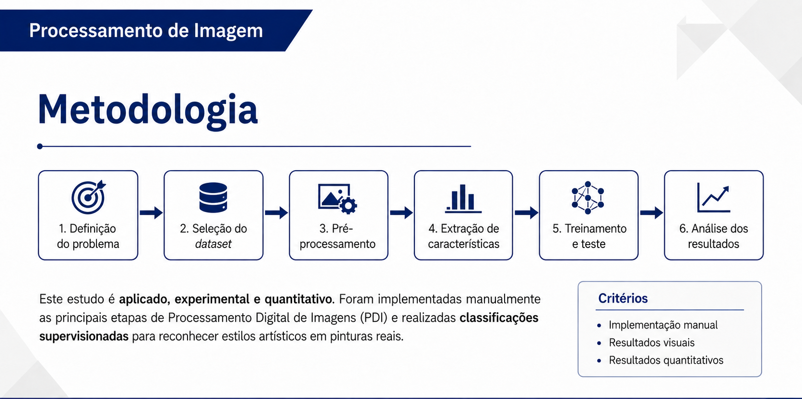
</p>

---

<table width="100%">
  <tr>
    <th width="24%" align="center">Etapa metodológica</th>
    <th width="76%" align="center">Descrição aplicada ao projeto</th>
  </tr>
  <tr>
    <td><strong>Definição do problema</strong></td>
    <td>Classificar pinturas reais em estilos artísticos usando descritores clássicos de imagem.</td>
  </tr>
  <tr>
    <td><strong>Seleção do dataset</strong></td>
    <td>Construção de um recorte balanceado do WikiArt com quatro classes e 50 imagens por classe.</td>
  </tr>
  <tr>
    <td><strong>Pré-processamento</strong></td>
    <td>Aplicação de conversão para cinza, suavização, bordas, segmentação e morfologia.</td>
  </tr>
  <tr>
    <td><strong>Extração de características</strong></td>
    <td>Geração de descritores numéricos baseados em cor, histograma, bordas, segmentação e DCT.</td>
  </tr>
  <tr>
    <td><strong>Avaliação</strong></td>
    <td>Treinamento, teste e interpretação dos modelos usando métricas quantitativas e resultados visuais.</td>
  </tr>
</table>

---

## 🔁 Pipeline clássico proposto

Todas as imagens seguem a mesma sequência de processamento. O modelo não recebe pixels brutos: ele recebe **descritores extraídos manualmente** a partir das etapas clássicas de PDI.

<p align="center">
  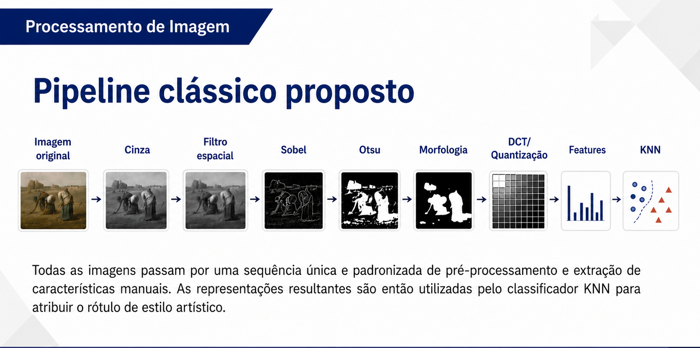
</p>

---

<table width="100%">
  <tr>
    <th width="10%" align="center">Visual</th>
    <th width="22%" align="center">Etapa</th>
    <th width="68%" align="center">Função no pipeline</th>
  </tr>
  <tr>
    <td align="center"></td>
    <td><strong>Imagem original</strong></td>
    <td>Entrada colorida do dataset WikiArt, preservando a informação visual inicial da pintura.</td>
  </tr>
  <tr>
    <td align="center"></td>
    <td><strong>Escala de cinza</strong></td>
    <td>Simplifica a análise estrutural e tonal, reduzindo a imagem para uma representação de intensidade.</td>
  </tr>
  <tr>
    <td align="center"></td>
    <td><strong>Filtro espacial</strong></td>
    <td>Suaviza pequenas variações locais antes da extração de bordas, reduzindo ruídos e transições muito abruptas.</td>
  </tr>
  <tr>
    <td align="center"></td>
    <td><strong>Sobel</strong></td>
    <td>Detecta bordas por gradientes horizontal e vertical, destacando contornos e estruturas da composição.</td>
  </tr>
  <tr>
    <td align="center"></td>
    <td><strong>Otsu</strong></td>
    <td>Segmenta automaticamente regiões claras e escuras por meio de um limiar calculado a partir do histograma.</td>
  </tr>
  <tr>
    <td align="center"></td>
    <td><strong>Morfologia</strong></td>
    <td>Refina a máscara binária por dilatação, erosão, abertura e fechamento, melhorando a continuidade das regiões.</td>
  </tr>
  <tr>
    <td align="center"></td>
    <td><strong>DCT / Quantização</strong></td>
    <td>Analisa frequência, compressibilidade e perda de informação a partir de blocos 8x8.</td>
  </tr>
  <tr>
    <td align="center"></td>
    <td><strong>Features</strong></td>
    <td>Concatena estatísticas, histogramas, bordas, segmentação, morfologia e frequência em um vetor numérico.</td>
  </tr>
  <tr>
    <td align="center"></td>
    <td><strong>KNN</strong></td>
    <td>Classifica a pintura de acordo com a proximidade entre vetores de características no espaço de atributos.</td>
  </tr>
</table>

---

## 🧩 Técnicas em destaque

### 1. Transformação espacial e bordas por Sobel

A transformação espacial converte a imagem para cinza, aplica suavização e calcula bordas. Esses resultados alimentam descritores como densidade de bordas, média do gradiente e variação estrutural da pintura.

---

<p align="center">
  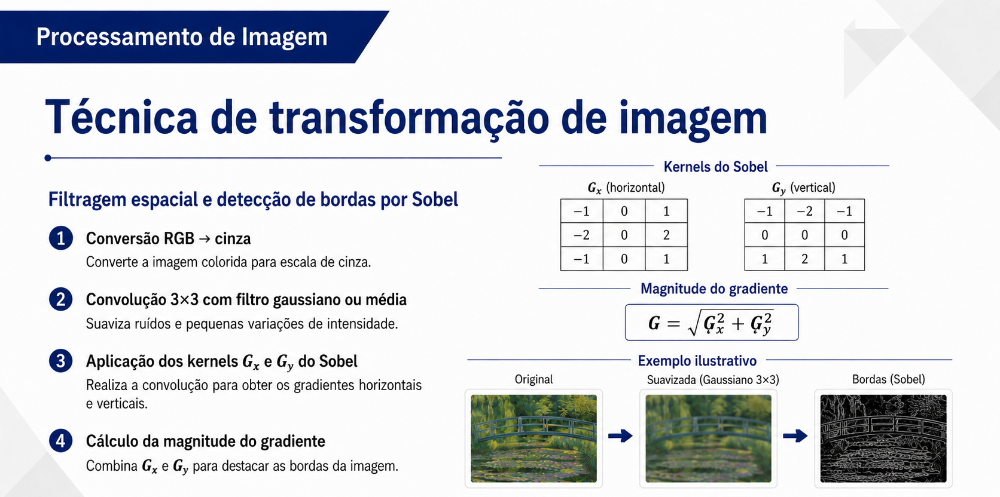
</p>

---

### 2. Segmentação por Otsu

A segmentação por Otsu calcula o histograma e escolhe o limiar que melhor separa regiões claras e escuras. A máscara binária gerada é usada na morfologia e na extração de descritores estruturais.

---

<p align="center">
  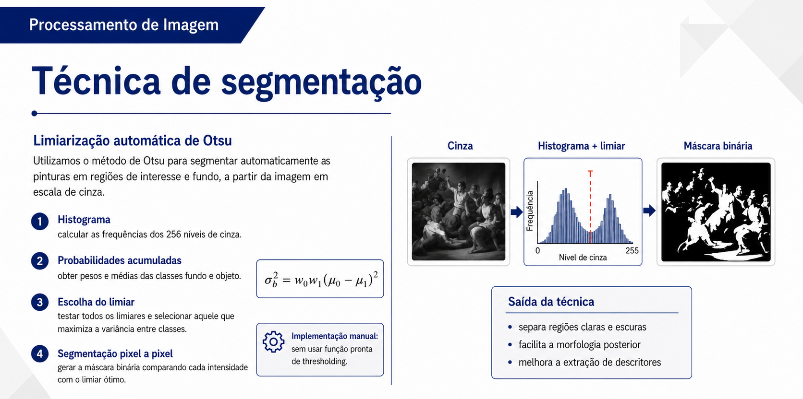
</p>

---

### 3. Morfologia binária

A morfologia atua sobre a máscara binária. O fechamento, formado por dilatação seguida de erosão, preenche pequenas falhas e melhora a continuidade das regiões segmentadas.

---

<p align="center">
  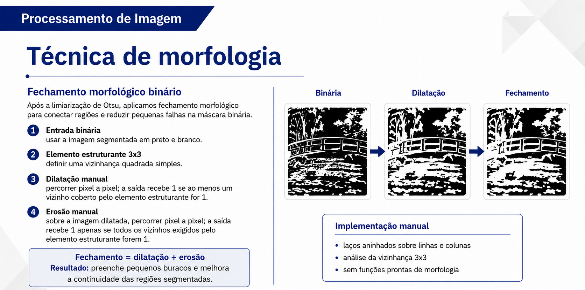
</p>

---

### 4. Compressão com DCT e quantização

A DCT em blocos 8x8 foi usada para analisar a energia no domínio da frequência. A quantização reduz a precisão dos coeficientes e permite medir MSE, PSNR, entropia e coeficientes zerados.

---

<p align="center">
  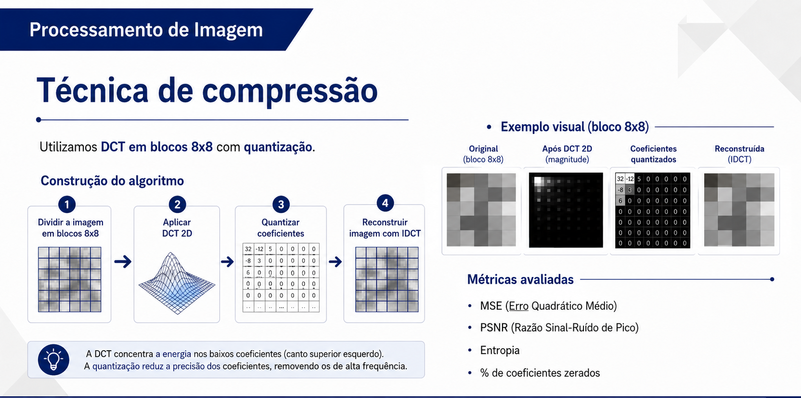
</p>

---

## 📊 Características extraídas

Cada imagem foi representada por um vetor de **97 características numéricas**.

<table width="100%">
  <tr>
    <th width="20%" align="center">Grupo</th>
    <th width="80%" align="center">Exemplos de características</th>
  </tr>
  <tr>
    <td><strong>Cor</strong></td>
    <td>Média, desvio padrão, assimetria e curtose nos canais RGB, usados para representar tendências cromáticas de cada estilo.</td>
  </tr>
  <tr>
    <td><strong>Histogramas</strong></td>
    <td>Distribuições normalizadas dos canais RGB e da imagem em escala de cinza, descrevendo a frequência dos níveis de intensidade.</td>
  </tr>
  <tr>
    <td><strong>Intensidade</strong></td>
    <td>Média, desvio, entropia e estatísticas globais da imagem em cinza, indicando contraste e variação tonal.</td>
  </tr>
  <tr>
    <td><strong>Bordas</strong></td>
    <td>Densidade de bordas, média e desvio do gradiente, extraídos a partir da magnitude do operador de Sobel.</td>
  </tr>
  <tr>
    <td><strong>Segmentação</strong></td>
    <td>Limiar de Otsu, proporção de foreground/background e estatísticas das regiões binárias segmentadas.</td>
  </tr>
  <tr>
    <td><strong>Morfologia</strong></td>
    <td>Quantidade de componentes conectados, proporção da maior região segmentada e medidas estruturais após refinamento morfológico.</td>
  </tr>
  <tr>
    <td><strong>Frequência / compressão</strong></td>
    <td>Energia DCT em bandas de frequência, entropia quantizada, MSE, PSNR e percentual de coeficientes zerados após quantização.</td>
  </tr>
</table>

---

## 🤖 Modelos de aprendizado de máquina

Foram avaliados modelos simples e interpretáveis, mantendo o foco principal no pipeline clássico de PDI.

<table width="100%">
  <tr>
    <th width="18%" align="center">Modelo</th>
    <th width="82%" align="center">Justificativa</th>
  </tr>
  <tr>
    <td><strong>KNN</strong></td>
    <td>Classificador simples baseado em distância entre vetores de características. Foi adequado ao projeto porque permite avaliar se os descritores manuais aproximam imagens visualmente semelhantes dentro do espaço de atributos.</td>
  </tr>
  <tr>
    <td><strong>Regressão Logística</strong></td>
    <td>Modelo linear usado como comparação quantitativa. Sua inclusão ajuda a verificar se as características extraídas apresentam separação linear mínima entre os estilos artísticos avaliados.</td>
  </tr>
</table>

Valores de `k` avaliados no KNN:

```text
k = 1, 3, 5, 7, 9, 11
```

---

## 📈 Resultados quantitativos

O melhor desempenho foi obtido com o modelo **KNN_k=9**.

<p align="center">
  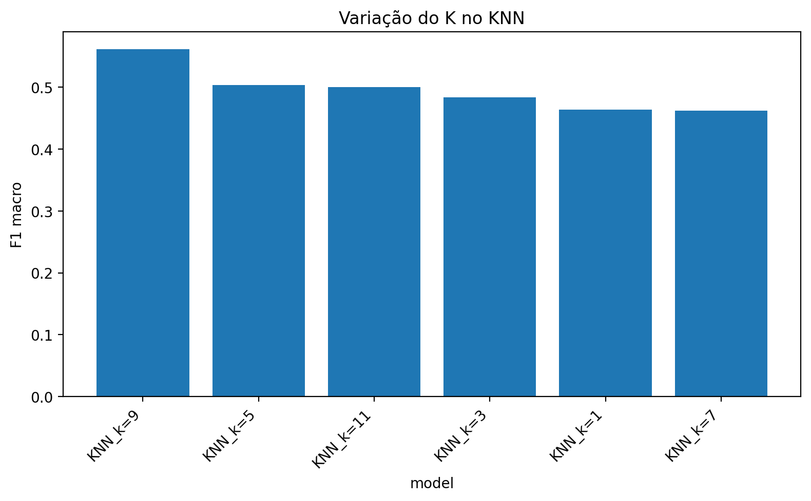
</p>

### Comparação entre modelos

<div align="center">
<table width="100%">
  <tr>
    <th width="22%" align="center">Modelo</th>
    <th width="18%" align="center">Acurácia</th>
    <th width="20%" align="center">Precisão macro</th>
    <th width="20%" align="center">Revocação macro</th>
    <th width="20%" align="center">F1 macro</th>
  </tr>
  <tr>
    <td align="center"><strong>KNN_k=9</strong></td>
    <td align="center"><strong>58.33%</strong></td>
    <td align="center"><strong>59.64%</strong></td>
    <td align="center"><strong>58.33%</strong></td>
    <td align="center"><strong>56.12%</strong></td>
  </tr>
  <tr>
    <td align="center">KNN_k=5</td>
    <td align="center">53.33%</td>
    <td align="center">54.32%</td>
    <td align="center">53.33%</td>
    <td align="center">50.35%</td>
  </tr>
  <tr>
    <td align="center">KNN_k=11</td>
    <td align="center">53.33%</td>
    <td align="center">53.46%</td>
    <td align="center">53.33%</td>
    <td align="center">49.98%</td>
  </tr>
  <tr>
    <td align="center">Regressão Logística</td>
    <td align="center">50.00%</td>
    <td align="center">49.26%</td>
    <td align="center">50.00%</td>
    <td align="center">48.59%</td>
  </tr>
</table>
</div>

### Métricas por classe — melhor modelo

<div align="center">
<table width="100%">
  <tr>
    <th width="28%" align="center">Classe</th>
    <th width="18%" align="center">Precisão</th>
    <th width="18%" align="center">Revocação</th>
    <th width="18%" align="center">F1-score</th>
    <th width="18%" align="center">Suporte</th>
  </tr>
  <tr>
    <td align="center"><strong>Baroque</strong></td>
    <td align="center">62.50%</td>
    <td align="center">66.67%</td>
    <td align="center">64.52%</td>
    <td align="center">15</td>
  </tr>
  <tr>
    <td align="center"><strong>Cubism</strong></td>
    <td align="center">77.78%</td>
    <td align="center">46.67%</td>
    <td align="center">58.33%</td>
    <td align="center">15</td>
  </tr>
  <tr>
    <td align="center"><strong>Impressionism</strong></td>
    <td align="center">53.85%</td>
    <td align="center">93.33%</td>
    <td align="center">68.29%</td>
    <td align="center">15</td>
  </tr>
  <tr>
    <td align="center"><strong>Realism</strong></td>
    <td align="center">44.44%</td>
    <td align="center">26.67%</td>
    <td align="center">33.33%</td>
    <td align="center">15</td>
  </tr>
</table>
</div>

---

## 🧪 Resultados de DCT, compressão e entropia

<table width="100%">
  <tr>
    <th width="12%" align="center">Classe</th>
    <th width="12.57%" align="center">Entropia</th>
    <th width="12.57%" align="center">Coef. zerados</th>
    <th width="12.57%" align="center">MSE</th>
    <th width="12.57%" align="center">PSNR</th>
    <th width="12.57%" align="center">Energia baixa</th>
    <th width="12.57%" align="center">Energia média</th>
    <th width="12.57%" align="center">Energia alta</th>
  </tr>
  <tr>
    <td><strong>Baroque</strong></td>
    <td align="center">6.42</td>
    <td align="center">85.14%</td>
    <td align="center">11.64</td>
    <td align="center">37.80</td>
    <td align="center">0.9752</td>
    <td align="center">0.0241</td>
    <td align="center">0.0007</td>
  </tr>
  <tr>
    <td><strong>Cubism</strong></td>
    <td align="center">7.22</td>
    <td align="center">79.03%</td>
    <td align="center">20.89</td>
    <td align="center">35.11</td>
    <td align="center">0.9261</td>
    <td align="center">0.0712</td>
    <td align="center">0.0027</td>
  </tr>
  <tr>
    <td><strong>Impressionism</strong></td>
    <td align="center">7.16</td>
    <td align="center">81.97%</td>
    <td align="center">15.32</td>
    <td align="center">36.52</td>
    <td align="center">0.9511</td>
    <td align="center">0.0471</td>
    <td align="center">0.0018</td>
  </tr>
  <tr>
    <td><strong>Realism</strong></td>
    <td align="center">7.12</td>
    <td align="center">82.11%</td>
    <td align="center">15.58</td>
    <td align="center">36.39</td>
    <td align="center">0.9617</td>
    <td align="center">0.0370</td>
    <td align="center">0.0013</td>
  </tr>
</table>

**Interpretação:** Cubism apresentou maior entropia e maior energia média/alta, indicando maior variação visual e fragmentação estrutural. Baroque concentrou mais energia em baixa frequência e teve maior taxa de coeficientes zerados.

---

## 🧾 Matriz de confusão

<p align="center">
  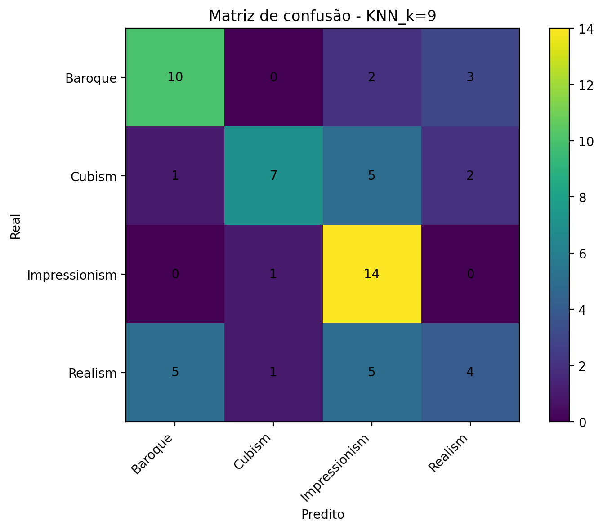
</p>

---

<table width="100%">
  <tr>
    <th width="18%" align="center">Observação</th>
    <th width="82%" align="center">Interpretação</th>
  </tr>
  <tr>
    <td><strong>Impressionism</strong></td>
    <td>Foi a classe mais reconhecida, com 14 acertos em 15 imagens, indicando que os descritores extraídos capturaram bem seus padrões de cor, textura e distribuição de bordas.</td>
  </tr>
  <tr>
    <td><strong>Baroque</strong></td>
    <td>Apresentou bom desempenho, com 10 acertos em 15 imagens, possivelmente por possuir características tonais e estruturais mais concentradas.</td>
  </tr>
  <tr>
    <td><strong>Realism</strong></td>
    <td>Teve maior confusão, principalmente com Baroque e Impressionism, mostrando que alguns estilos compartilham características cromáticas, tonais e espaciais semelhantes.</td>
  </tr>
  <tr>
    <td><strong>Leitura geral</strong></td>
    <td>Os descritores clássicos capturam padrões úteis para classificação, mas a sobreposição visual entre estilos artísticos limita o desempenho de modelos simples baseados apenas em características manuais.</td>
  </tr>
</table>

---

## 🖼️ Resultados visuais do pipeline

As imagens abaixo mostram exemplos reais processados pelo pipeline. Cada figura apresenta etapas como imagem original, escala de cinza, filtro espacial, Sobel, Otsu, morfologia, DCT e reconstrução.

<table width="100%">
  <tr>
    <th width="50%" align="center">Baroque</th>
    <th width="50%" align="center">Cubism</th>
  </tr>
  <tr>
    <td align="center">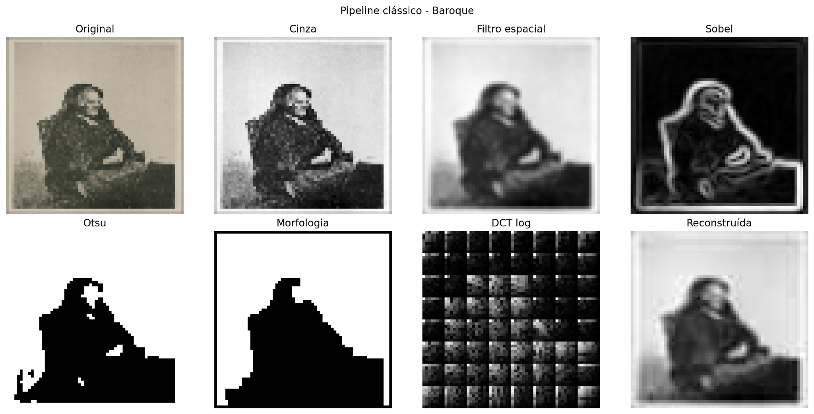</td>
    <td align="center">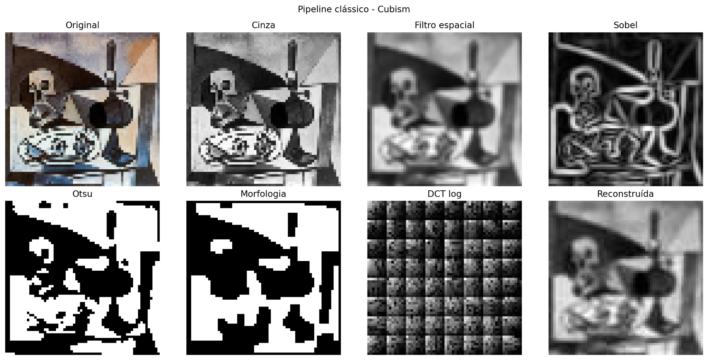</td>
  </tr>
</table>

<table width="100%">
  <tr>
    <th width="50%" align="center">Impressionism</th>
    <th width="50%" align="center">Realism</th>
  </tr>
  <tr>
    <td align="center">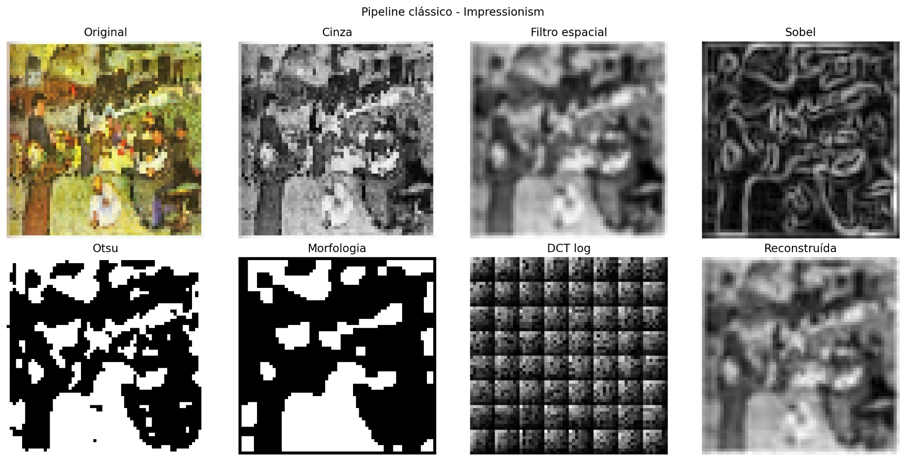</td>
    <td align="center">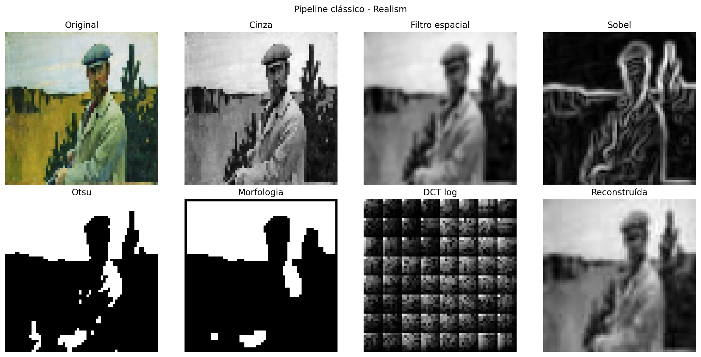</td>
  </tr>
</table>

---

## 📁 Estrutura do repositório

Estrutura atual versionada no GitHub:

```text
pdi-art-style-classification/
│
├── assets/
├── src/
│   ├── __init__.py
│   ├── config.py
│   ├── features.py
│   ├── io_utils.py
│   ├── pdi_manual.py
│   └── visualize.py
│
├── .gitignore
├── README.md
├── baixar_recorte_wikiart.py
├── download_wikiart_huggingface.py
├── requirements.txt
├── requirements_optional.txt
├── run_all.py
├── run_extract_features.py
└── run_train_models.py
```

Pastas geradas localmente durante a execução:

```text
data/raw/      # pinturas reais baixadas do WikiArt
results/       # métricas, tabelas, imagens e CSVs gerados pelo pipeline
```

---

## ▶️ Como executar

### 1. Clonar o repositório

```bash
git clone https://github.com/o0-James-0o/pdi-art-style-classification.git
cd pdi-art-style-classification
```

### 2. Instalar dependências

```bash
pip install -r requirements.txt
```

### 3. Baixar o recorte do WikiArt

```bash
python baixar_recorte_wikiart.py
```

Estrutura esperada após o download:

```text
data/raw/Baroque/
data/raw/Cubism/
data/raw/Impressionism/
data/raw/Realism/
```

### 4. Rodar o pipeline completo

```bash
python run_all.py
```

### 5. Rodar por etapas

```bash
python run_extract_features.py
python run_train_models.py
```

---

## 📦 Saídas geradas

<table width="100%">
  <tr>
    <th width="24%" align="center">Arquivo</th>
    <th width="76%" align="center">Conteúdo</th>
  </tr>
  <tr>
    <td><code>features.csv</code></td>
    <td>Arquivo tabular com os vetores de características extraídos de cada pintura, incluindo descritores de cor, intensidade, bordas, segmentação, morfologia e frequência.</td>
  </tr>
  <tr>
    <td><code>compression_metrics.csv</code></td>
    <td>Tabela com métricas relacionadas à DCT, quantização, entropia, MSE, PSNR e percentual de coeficientes zerados por imagem.</td>
  </tr>
  <tr>
    <td><code>model_comparison.csv</code></td>
    <td>Comparação entre os modelos avaliados, incluindo diferentes valores de k no KNN e o desempenho da Regressão Logística.</td>
  </tr>
  <tr>
    <td><code>classification_report_best.csv</code></td>
    <td>Relatório com precisão, revocação, F1-score e suporte para cada classe no melhor modelo encontrado.</td>
  </tr>
  <tr>
    <td><code>confusion_matrix_best.png</code></td>
    <td>Imagem da matriz de confusão do melhor modelo, usada para interpretar acertos e confusões entre estilos artísticos.</td>
  </tr>
  <tr>
    <td><code>knn_k_variation.png</code></td>
    <td>Gráfico que mostra como a variação do valor de k influencia o F1 macro do classificador KNN.</td>
  </tr>
  <tr>
    <td><code>visual_pipeline/</code></td>
    <td>Pasta com figuras visuais das etapas do pipeline para exemplos de cada classe, facilitando a análise qualitativa dos resultados.</td>
  </tr>
</table>

---

## ✅ Conclusão

O projeto demonstrou que técnicas clássicas de Processamento Digital de Imagens podem ser integradas em um fluxo único, interpretável e aplicado a pinturas reais. Mesmo com desempenho moderado, o melhor modelo (**KNN_k=9**) superou o acaso esperado para quatro classes balanceadas e evidenciou que descritores manuais carregam informação discriminativa sobre estilos artísticos.

<table width="100%">
  <tr>
    <th width="18%" align="center">Resultado</th>
    <th width="82%" align="center">Interpretação</th>
  </tr>
  <tr>
    <td><strong>Melhor modelo</strong></td>
    <td>KNN_k=9 obteve o melhor desempenho geral entre as configurações avaliadas, indicando que uma vizinhança maior reduziu oscilações e aproveitou melhor os descritores extraídos.</td>
  </tr>
  <tr>
    <td><strong>Acurácia</strong></td>
    <td>58.33%, acima do acaso esperado de 25% para quatro classes balanceadas, demonstrando que os descritores manuais carregam informação discriminativa sobre os estilos.</td>
  </tr>
  <tr>
    <td><strong>Interpretação</strong></td>
    <td>Características de borda, textura, segmentação e frequência contribuíram para separar estilos artísticos, mesmo sem utilizar a imagem bruta diretamente no modelo.</td>
  </tr>
  <tr>
    <td><strong>Classes</strong></td>
    <td>Impressionism e Baroque foram mais reconhecidas, enquanto Realism apresentou maior confusão por compartilhar padrões tonais, cromáticos e estruturais com outras classes.</td>
  </tr>
</table>

---

## 👨‍💻 Autoria

<div align="left">
  
  &nbsp;&nbsp;
  
</div>

---
