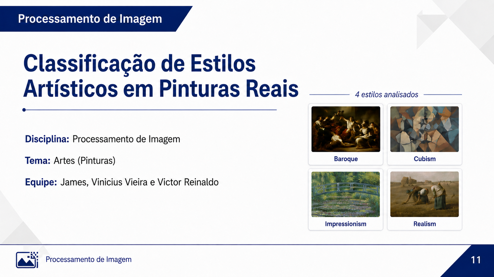
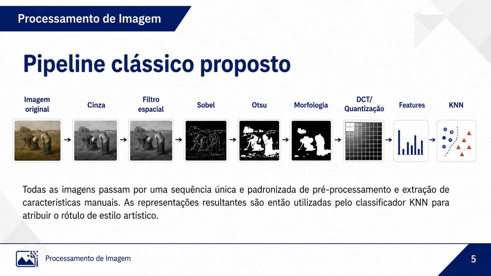
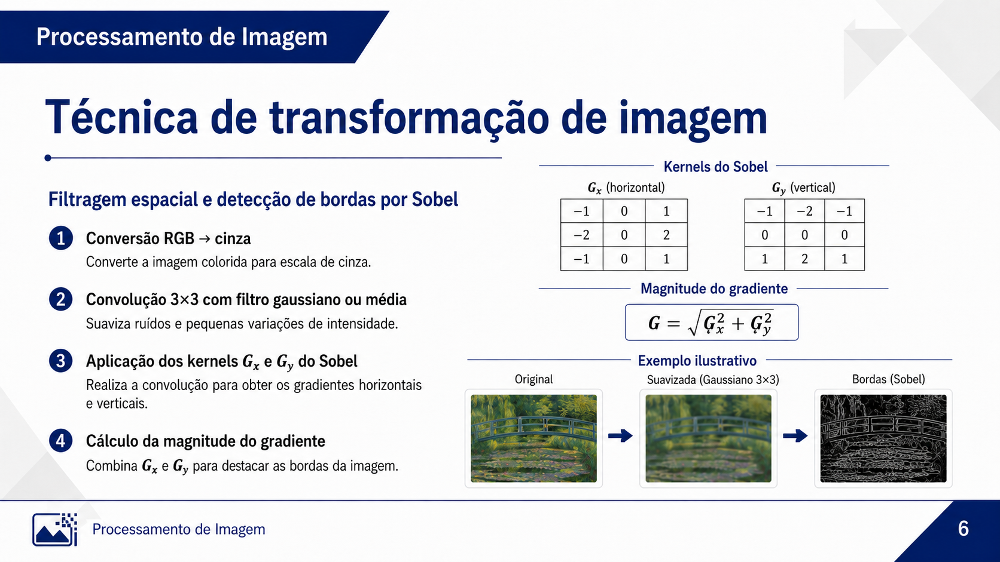
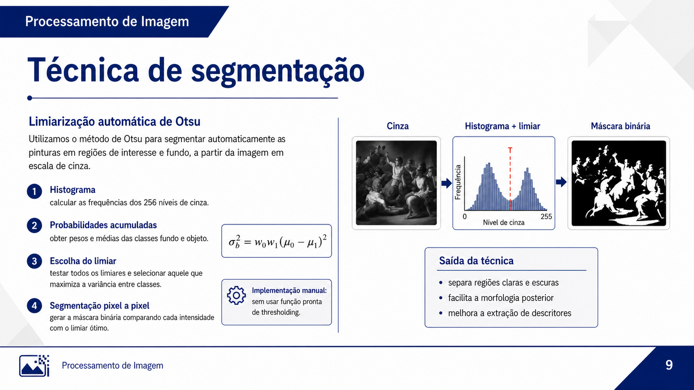
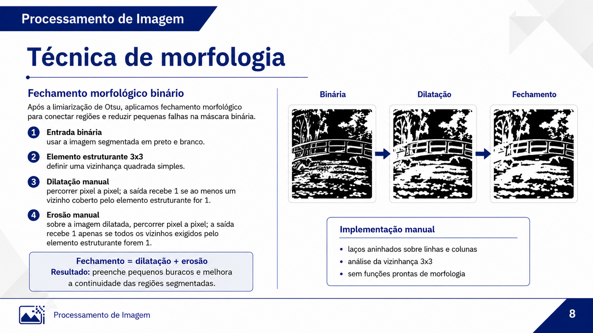
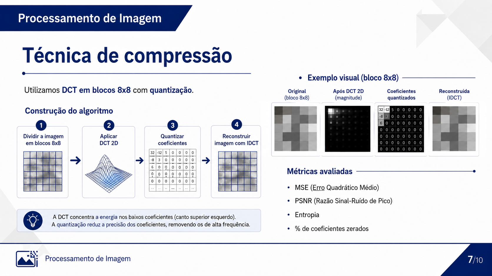

# 🖼️ Classificação de Estilos Artísticos em Pinturas Reais com Pipeline Clássico de PDI

<p align="center">
  
</p>

<p align="center">
  
  
  
  
</p>

---

## 📌 Visão geral

Este projeto apresenta um **pipeline clássico de Processamento Digital de Imagens (PDI)** aplicado à **classificação de estilos artísticos em pinturas reais**. O trabalho utiliza um recorte enxuto do dataset **WikiArt**, com imagens dos estilos **Baroque**, **Cubism**, **Impressionism** e **Realism**.

A proposta prioriza o entendimento dos métodos clássicos de PDI: as principais etapas foram implementadas **manualmente**, sem uso de funções prontas para convolução, Sobel, Otsu, morfologia, DCT, quantização e extração de descritores.

---

## 👥 Equipe

| Integrante | Responsabilidade principal |
|---|---|
| **James** | Introdução, dataset, metodologia e pipeline clássico |
| **Vinicius Vieira** | Técnicas de transformação, segmentação e morfologia |
| **Victor Reinaldo** | Compressão, resultados, análise e conclusão |

**Disciplina:** Processamento de Imagem  
**Tema:** Artes — Pinturas reais  
**Tarefa:** Classificação automática de estilos artísticos

---

## 🎯 Objetivo

Desenvolver e avaliar um sistema capaz de **extrair características visuais clássicas de pinturas reais** e utilizá-las em modelos simples de aprendizado de máquina para classificar estilos artísticos.

O objetivo central não é apenas obter acurácia, mas demonstrar como técnicas fundamentais de PDI podem representar aspectos visuais como:

- cor;
- textura;
- bordas;
- regiões segmentadas;
- energia em frequência;
- entropia;
- padrões estruturais da imagem.

---

## ✅ Requisitos do projeto atendidos

| Requisito solicitado | Como foi atendido |
|---|---|
| Dataset relacionado ao tema | Recorte real do **WikiArt** com pinturas de 4 estilos |
| Transformação de imagem | Conversão RGB → cinza, filtro espacial e Sobel manual |
| Compressão ou análise da informação | DCT 8x8, quantização, entropia, MSE e PSNR |
| Segmentação | Limiarização automática de Otsu implementada manualmente |
| Morfologia | Dilatação, erosão e fechamento morfológico manual |
| Representação e descrição | Histogramas, estatísticas, bordas, componentes e energia DCT |
| Aprendizado de máquina | KNN e Regressão Logística com `scikit-learn` |
| Resultados visuais | Figuras do pipeline para cada estilo |
| Resultados quantitativos | Acurácia, precisão, revocação, F1-score e matriz de confusão |
| Implementação manual | Principais algoritmos de PDI implementados sem funções prontas |

---

## 🗂️ Dataset e recorte experimental

O projeto utiliza um recorte de **200 pinturas reais** do WikiArt, organizado de forma balanceada.

| Classe | Quantidade | Treino | Teste |
|---|---:|---:|---:|
| Baroque | 50 | 35 | 15 |
| Cubism | 50 | 35 | 15 |
| Impressionism | 50 | 35 | 15 |
| Realism | 50 | 35 | 15 |
| **Total** | **200** | **140** | **60** |

<p align="center">
  
</p>

### Estrutura esperada do dataset

```text
pdi_art_paintings_pipeline/
└── data/
    └── raw/
        ├── Baroque/
        ├── Cubism/
        ├── Impressionism/
        └── Realism/
```

> As imagens reais do WikiArt não precisam ser versionadas no repositório. Recomenda-se disponibilizar apenas o script de download/recorte e documentar o procedimento.

---

## 🧠 Metodologia

A metodologia adotada é **aplicada, experimental e quantitativa**. O fluxo segue uma lógica próxima ao reconhecimento estatístico de padrões: preparação dos dados, extração de características, treinamento, teste e interpretação dos resultados.


---

## 🔁 Pipeline clássico proposto

Todas as imagens passam pela mesma sequência de processamento. O modelo de aprendizado de máquina recebe **descritores extraídos manualmente**, e não a imagem bruta.

<p align="center">
  
</p>

### Etapas principais

| Etapa | Função no pipeline |
|---|---|
| Imagem original | Entrada colorida do dataset |
| Escala de cinza | Simplifica a análise estrutural e tonal |
| Filtro espacial | Suaviza ruídos e pequenas variações locais |
| Sobel | Detecta bordas por gradiente horizontal e vertical |
| Otsu | Segmenta a imagem por limiar automático |
| Morfologia | Refina a máscara binária por dilatação/erosão |
| DCT e quantização | Analisa energia em frequência e compressibilidade |
| Features | Concatena descritores numéricos |
| KNN | Classifica o estilo artístico |

---

## 🛠️ Implementações manuais de PDI

As etapas principais foram implementadas manualmente, utilizando laços, operações matriciais e fórmulas clássicas.

| Técnica | Implementação manual realizada |
|---|---|
| Conversão RGB → cinza | Combinação ponderada dos canais RGB |
| Redimensionamento | Interpolação bilinear |
| Convolução 2D | Aplicação manual de kernel sobre a vizinhança |
| Filtro espacial | Máscara gaussiana/média 3x3 |
| Sobel | Máscaras `Gx` e `Gy` com magnitude do gradiente |
| Histograma | Contagem manual de níveis de intensidade |
| Entropia | Cálculo por distribuição de probabilidades |
| Otsu | Teste de limiares e maximização da variância entre classes |
| Morfologia | Erosão, dilatação, abertura e fechamento com elemento 3x3 |
| Componentes conectados | Rotulação e cálculo de regiões |
| DCT 8x8 | Transformada por blocos e coeficientes de frequência |
| Quantização | Redução da precisão dos coeficientes DCT |
| IDCT | Reconstrução após quantização |
| MSE e PSNR | Avaliação da reconstrução |

> O OpenCV foi utilizado apenas para **leitura e escrita de imagens**. O `scikit-learn` foi utilizado somente na etapa permitida de aprendizado de máquina.

---

## 🧩 Técnicas em destaque

### 1. Transformação de imagem — filtro espacial e Sobel

<p align="center">
  
</p>

A transformação espacial foi usada para converter a imagem em cinza, suavizar variações locais e calcular bordas com Sobel. O gradiente resultante contribui para descritores como **densidade de bordas**, **média do gradiente** e **entropia do gradiente**.

### 2. Segmentação — Otsu manual

<p align="center">
  
</p>

A segmentação foi realizada com Otsu, calculando o histograma e testando limiares para separar regiões claras e escuras. A máscara binária gerada alimenta as etapas de morfologia e extração estrutural.

### 3. Morfologia — fechamento binário

<p align="center">
  
</p>

A morfologia foi aplicada sobre a máscara binária. O fechamento, formado por **dilatação seguida de erosão**, ajuda a preencher pequenas falhas e melhorar a continuidade das regiões segmentadas.

### 4. Compressão — DCT 8x8 e quantização

<p align="center">
  
</p>

A DCT em blocos 8x8 foi usada para analisar a distribuição de energia no domínio da frequência. A quantização reduz a precisão dos coeficientes, permitindo medir entropia, PSNR, MSE e percentual de coeficientes zerados.

---

## 📊 Características extraídas

Cada imagem foi representada por um vetor de **97 características numéricas**.

| Grupo de características | Exemplos |
|---|---|
| Cor | média, desvio, assimetria e curtose em RGB |
| Histogramas | histogramas normalizados RGB e cinza |
| Intensidade | média, desvio, entropia e estatísticas da imagem em cinza |
| Bordas | densidade de bordas, média/desvio do gradiente |
| Segmentação | limiar de Otsu, proporção de foreground/background |
| Morfologia | componentes conectados e maior região segmentada |
| Frequência | energia DCT baixa, média e alta |
| Compressão | entropia quantizada, MSE, PSNR e coeficientes zerados |

---

## 🤖 Modelos de aprendizado de máquina

Foram avaliados modelos simples e interpretáveis, adequados ao foco do trabalho em PDI clássico.

| Modelo | Justificativa |
|---|---|
| **KNN** | Classificador simples baseado em distância entre vetores de características |
| **Regressão Logística** | Modelo linear usado como comparação quantitativa |

Foram testados diferentes valores de `k` no KNN:

```text
k = 1, 3, 5, 7, 9, 11
```

---

## 📈 Resultados quantitativos

O melhor desempenho foi obtido com o modelo **KNN_k=9**.

<p align="center">
  
</p>

### Comparação dos modelos

| Modelo | Acurácia | Precisão macro | Revocação macro | F1 macro |
|---|---:|---:|---:|---:|
| **KNN_k=9** | **58.33%** | **59.64%** | **58.33%** | **56.12%** |
| KNN_k=5 | 53.33% | 54.32% | 53.33% | 50.35% |
| KNN_k=11 | 53.33% | 53.46% | 53.33% | 49.98% |
| LogisticRegression | 50.00% | 49.26% | 50.00% | 48.59% |
| KNN_k=3 | 50.00% | 51.79% | 50.00% | 48.34% |
| KNN_k=1 | 46.67% | 52.49% | 46.67% | 46.36% |
| KNN_k=7 | 50.00% | 50.83% | 50.00% | 46.19% |

### Métricas por classe — melhor modelo

| Classe | Precisão | Revocação | F1-score | Suporte |
|---|---:|---:|---:|---:|
| Baroque | 62.50% | 66.67% | 64.52% | 15 |
| Cubism | 77.78% | 46.67% | 58.33% | 15 |
| Impressionism | 53.85% | 93.33% | 68.29% | 15 |
| Realism | 44.44% | 26.67% | 33.33% | 15 |
| **Macro avg** | **59.64%** | **58.33%** | **56.12%** | **60** |

---

## 🧪 Resultados de DCT, compressão e entropia

| Classe | Entropia média | Coef. zerados | MSE médio | PSNR médio | Energia baixa | Energia média | Energia alta |
|---|---:|---:|---:|---:|---:|---:|---:|
| Baroque | 6.42 | 85.14% | 11.64 | 37.80 | 0.9752 | 0.0241 | 0.0007 |
| Cubism | 7.22 | 79.03% | 20.89 | 35.11 | 0.9261 | 0.0712 | 0.0027 |
| Impressionism | 7.16 | 81.97% | 15.32 | 36.52 | 0.9511 | 0.0471 | 0.0018 |
| Realism | 7.12 | 82.11% | 15.58 | 36.39 | 0.9617 | 0.0370 | 0.0013 |

A análise mostra que **Cubism** apresentou maior entropia e maior energia média/alta, sugerindo maior variação visual e fragmentação estrutural. **Baroque** concentrou mais energia em baixa frequência e teve maior taxa de coeficientes zerados.

---

## 🧾 Matriz de confusão

<p align="center">
  
</p>

### Interpretação

- **Impressionism** foi a classe mais reconhecida: 14 acertos em 15 imagens.
- **Baroque** apresentou bom desempenho: 10 acertos em 15 imagens.
- **Realism** teve maior confusão, principalmente com Baroque e Impressionism.
- O resultado indica que descritores clássicos capturam padrões úteis, mas alguns estilos compartilham características visuais parecidas.

---

## 🖼️ Resultados visuais do pipeline

As imagens abaixo mostram exemplos reais processados pelo pipeline. Cada figura apresenta etapas como imagem original, escala de cinza, filtro espacial, Sobel, Otsu, morfologia, DCT e reconstrução.

| Baroque | Cubism |
|---|---|
|  |  |

| Impressionism | Realism |
|---|---|
|  |  |

---

## 📁 Estrutura recomendada do repositório

```text
pdi_art_paintings_pipeline/
│
├── data/
│   └── raw/
│       ├── Baroque/
│       ├── Cubism/
│       ├── Impressionism/
│       └── Realism/
│
├── results/
│   ├── features.csv
│   ├── compression_metrics.csv
│   ├── model_comparison.csv
│   ├── classification_report_best.csv
│   ├── confusion_matrix_best.png
│   ├── knn_k_variation.png
│   └── visual_pipeline/
│
├── src/
│   ├── config.py
│   ├── io_utils.py
│   ├── pdi_manual.py
│   ├── features.py
│   └── visualize.py
│
├── run_extract_features.py
├── run_train_models.py
├── run_all.py
├── requirements.txt
└── README.md
```

---

## ▶️ Como executar

### 1. Instalar dependências

```bash
pip install -r requirements.txt
```

### 2. Organizar o dataset

Coloque as imagens nas pastas:

```text
data/raw/Baroque/
data/raw/Cubism/
data/raw/Impressionism/
data/raw/Realism/
```

### 3. Executar todo o pipeline

```bash
python run_all.py
```

### 4. Executar por etapas

```bash
python run_extract_features.py
python run_train_models.py
```

---

## 📦 Saídas geradas

| Arquivo | Conteúdo |
|---|---|
| `features.csv` | Vetores de características das imagens |
| `compression_metrics.csv` | Métricas de DCT, entropia, MSE e PSNR |
| `model_comparison.csv` | Comparação entre KNN e Regressão Logística |
| `classification_report_best.csv` | Métricas por classe do melhor modelo |
| `confusion_matrix_best.png` | Matriz de confusão do melhor modelo |
| `knn_k_variation.png` | Gráfico de variação do K no KNN |
| `experiment_summary.json` | Resumo geral do experimento |
| `visual_pipeline/` | Figuras visuais do pipeline por classe |

---

## 🧠 Principais conclusões

- O pipeline clássico foi aplicado com sucesso em **200 pinturas reais**.
- O melhor modelo foi o **KNN_k=9**, com **58.33% de acurácia** e **56.12% de F1 macro**.
- O desempenho superou o acaso esperado para quatro classes balanceadas, que seria aproximadamente **25%**.
- **Impressionism** e **Baroque** foram melhor reconhecidos.
- **Realism** apresentou maior confusão com outros estilos.
- A integração de bordas, segmentação, morfologia, frequência e estatísticas gerou descritores interpretáveis.

---

## 🚀 Trabalhos futuros

- Ampliar o número de imagens por classe.
- Testar descritores de textura, como LBP e GLCM.
- Avaliar validação cruzada estratificada.
- Comparar o pipeline clássico com CNNs.
- Investigar seleção de características para reduzir dimensionalidade.
- Testar outros classificadores, como SVM, Random Forest e Gradient Boosting.

---

## 📝 Observações sobre reprodutibilidade

- O recorte usado foi balanceado: 50 imagens por classe.
- A divisão usada foi 70% treino e 30% teste.
- O melhor modelo foi selecionado por F1 macro.
- Os arquivos brutos de resultado foram preservados em `results_raw/`.
- As imagens do dataset podem variar caso o recorte seja refeito com outra ordem ou outra semente.

---

## 📚 Referências principais

- Gonzalez, R. C.; Woods, R. E. *Digital Image Processing*.
- Otsu, N. A Threshold Selection Method from Gray-Level Histograms.
- Sobel, I. An Isotropic 3x3 Image Gradient Operator.
- Wallace, G. K. The JPEG Still Picture Compression Standard.
- Cover, T.; Hart, P. Nearest Neighbor Pattern Classification.
- WikiArt Dataset — Hugging Face/Kaggle.

---

<p align="center">
  <strong>Projeto desenvolvido para a disciplina de Processamento de Imagem.</strong><br>
  Tema: <strong>Artes — Pinturas reais</strong>
</p>
